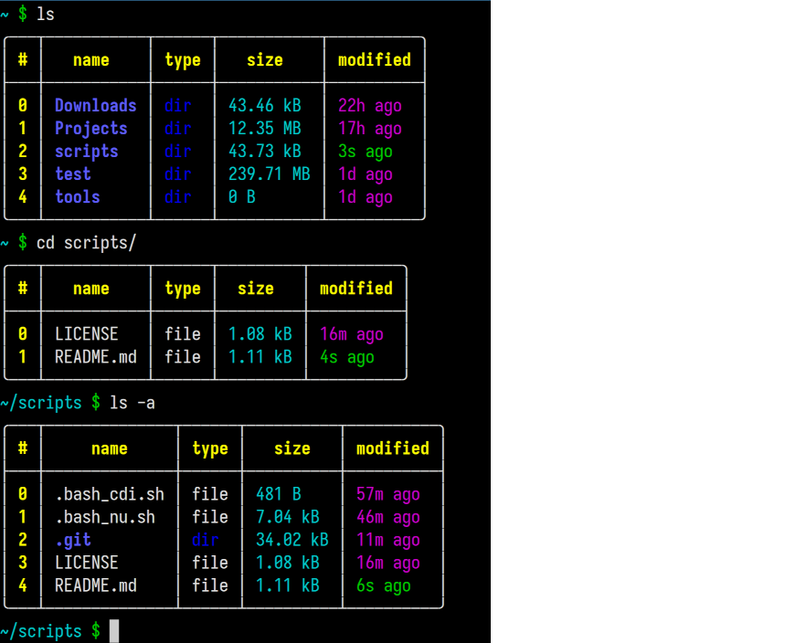

# Bash-Nu-mimic

A minimalist Bash script that mimics the **visual appearance of [nu-shell](https://github.com/nushell/nushell)** — while staying **POSIX-compliant** and lightweight. 




---

## Features

### Bash version
- NuShell mimic of `ls` output in Bash
- Lightweight and dependency-free
- Easy to install and use

### Python version
- NuShell inspired `ls` output in shell
- Very fast output
- Customizable colors
---

## Installation

Create a scripts directory if you don't have one
```bash
mkdir -p ~/scripts
cd ~/scripts
```

Clone the repo with
```bash
git clone https://github.com/V-Q-M/Bash-Nu-mimic.git
```

### Bash version

Add the script to your .bashrc
```bash
echo '. "$HOME/scripts/bash_nu.sh"' >> ~/.bashrc
```

Reload the shell (or restart terminal):
```bash
source ~/.bashrc
```
### Python version

Add a alias to your .bashrc
```bash
echo 'alias lsn="~/scripts/sh_nu.py"' >> ~/.bashrc
```

## Usage
Use the custom `lsn` command for NuShell-inspired directory listings.
```bash
lsn              # default listing
lsn -a           # Show hidden files.
lsn <path>`      # Show files in specified directory.
```

To replace `ls` with `lsn`, add the alias to your `.bashrc`
```bash
alias ls="lsn"
```

Then reload the shell (or restart terminal):
```bash
source ~/.bashrc
```

---

This project also features a experimental `cdi` (cd immediate), which allows cd-ing with a index on top of using directory names. E.g. `cdi 0` cds into the entry with index 0, if it is a directory.

## License
This project is released under the MIT License
